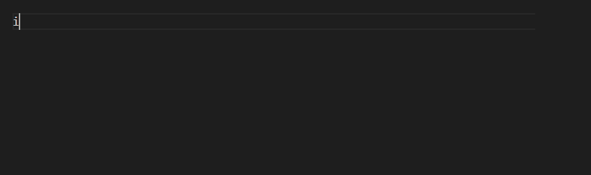

# ncl-vscode-support

NCL (NCAR Command Language) support for Visual Studio Code

## Note

- To summarize the status of NCL, the project is "**feature frozen**".
- NCAR has made the decision to adopt Python as the scripting language platform of choice for future development of analysis and visualization tools.

more information [here](http://www.ncl.ucar.edu/Document/Pivot_to_Python/)

## Features

### Syntax Highlighting

The final display effect is affected by the theme, try more different and find your favorite theme. I using `Ayu` theme, which is shown above.

### Code Snippets

### Code Completion Proposals

## Known Issues

Not yet, if you find any, please tell me.

-----------------------------------------------------------------------------------------------------------

**Enjoy it!**
