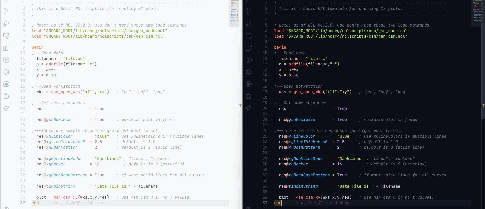

# ncl-vscode-support

为 Visual Studio Code 添加 NCL（NCAR 命令语言）支持

[English](./README.md) | [简体中文](./README_zh_cn.md)

## 注意

- 目前 NCL 项目已冻结，后续不再维护。
- NCAR 已决定采用 Python 作为未来分析和可视化工具开发的首选脚本语言平台。

更多信息参见 [此处](http://www.ncl.ucar.edu/Document/Pivot_to_Python/)

## 功能

### 语法高亮

最终显示效果受主题影响，建议尝试不同的主题以找到自己喜欢的主题。我使用的“Ayu”主题，如上所示。

可以使用 `@category:"themes"` 过滤器在 `Extensions` 视图 (Ctrl+Shift+X) 中搜索框中搜索主题。然后，使用 **文件** > **首选项** > **颜色主题** 打开颜色主题选择器。（在 macOS 上为 **代码** > **首选项** > **颜色主题**）。[此处](https://code.visualstudio.com/docs/getstarted/themes) 查看官方教程。

### 代码片段

### 代码完成建议

## 已知的问题

暂时还没有，如果你找到了，请告诉我。

-----------------------------------------------------------------------------------------------------------

**使用愉快!**
